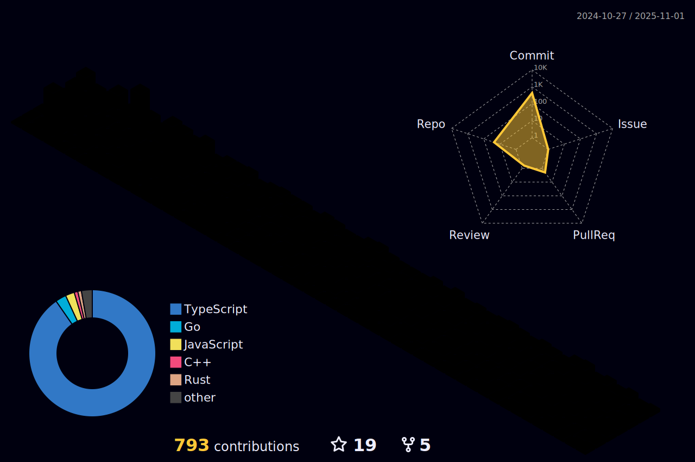

<!--

  
  

-->

     

<h1 align="center">Hi 👋, I'm Siddharth Singh Rana</h1>

  

- Find out what I'm [exploring](https://canary-skate-0f1.notion.site/e865e017332a4331b5e5bb6bf2961c99?v=f702d982517b41d6a24df10067bac140&pvs=74) right now.
- Take a look at my [resume](https://github.com/NIXBLACK11/NIXBLACK11/blob/main/SiddharthResume2.pdf)
- 🔭 I’m currently working on **[Nixarcade](https://github.com/NIXBLACK11/Solabule)(A place to play games, powered by Solana).**

- 👯 I’m looking to collaborate on **Anything related to web development and machine learning.**

- 👨‍💻 All of my projects are available at [https://github.com/NIXBLACK11](https://github.com/NIXBLACK11)

- 📫 This is my personal portfolio [Siddharth's Portfolio](https://nixblack.site/)

<h3 align="left">Some of the PRs I made during my time at Major League Hacking</h3>

- 🚀 [Sentiment analysis laser](https://github.com/facebookresearch/LASER/pull/274)

- 📚 [Parity with perl normalize](https://github.com/hplt-project/sacremoses/pull/146)
  
- 📦 [Update language_list.py](https://github.com/facebookresearch/LASER/pull/269)

- 🛠️ [Adding Language Validation Test](https://github.com/facebookresearch/LASER/pull/257)

- 📈 [An error initializing English pipeline](https://github.com/facebookresearch/LASER/issues/259)

<h3 align="left">Connect with me:</h3>

    
    

