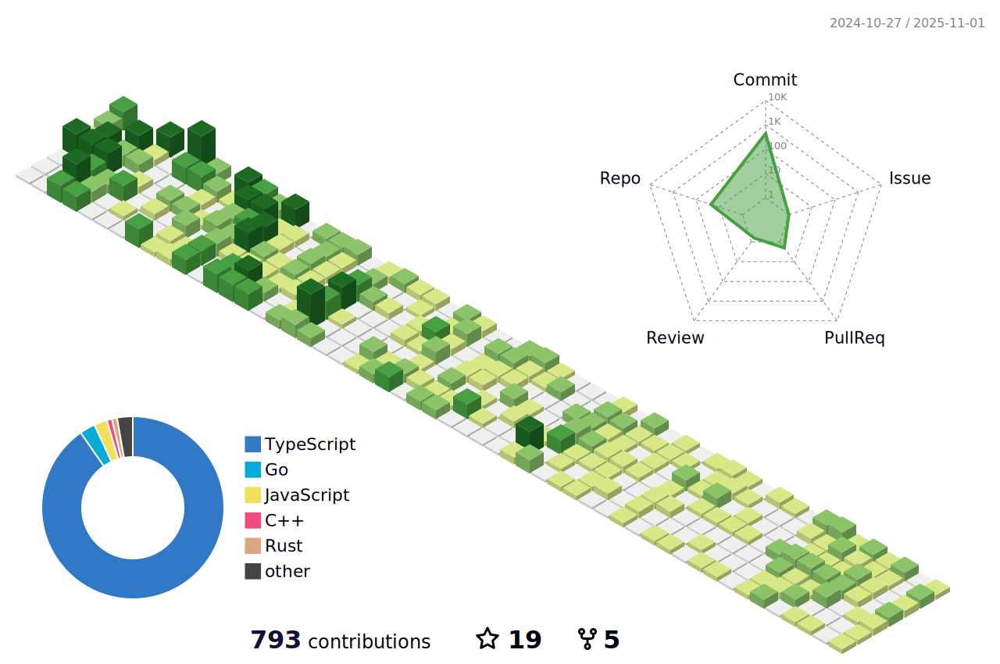

<!--

  
  

-->

     

<h1 align="center">Hi 👋, I'm Siddharth Singh Rana</h1>

  

- Find out what I'm [exploring](https://canary-skate-0f1.notion.site/e865e017332a4331b5e5bb6bf2961c99?v=f702d982517b41d6a24df10067bac140&pvs=74) right now.
- Take a look at my [resume](https://github.com/NIXBLACK11/NIXBLACK11/blob/main/SiddharthResume2.pdf)
- 🔭 I’m currently working on **[Nixarcade](https://github.com/NIXBLACK11/Solabule)(A place to play games, powered by Solana).**

- 👯 I’m looking to collaborate on **Anything related to web development and machine learning.**

- 👨‍💻 All of my projects are available at [https://github.com/NIXBLACK11](https://github.com/NIXBLACK11)

- 📫 This is my personal portfolio [Siddharth's Portfolio](https://nixblack.site/)

<h3 align="left">Some of the PRs I made during my time at Major League Hacking</h3>

- 🚀 [Sentiment analysis laser](https://github.com/facebookresearch/LASER/pull/274)

- 📚 [Parity with perl normalize](https://github.com/hplt-project/sacremoses/pull/146)
  
- 📦 [Update language_list.py](https://github.com/facebookresearch/LASER/pull/269)

- 🛠️ [Adding Language Validation Test](https://github.com/facebookresearch/LASER/pull/257)

- 📈 [An error initializing English pipeline](https://github.com/facebookresearch/LASER/issues/259)

<h3 align="left">Projects:</h3>
<h2 align="left">Web development + Machine Learning</h2>

- 🚀 [Chrome Extension for Text Summarization using BERT](https://github.com/NIXBLACK11/summarizationExtension)

- 🛠️ [Joblinker](https://github.com/NIXBLACK11/GeminiChallenge)

- 📦 [The Feedback Loop](https://github.com/NIXBLACK11/The-Feedback-Loop)

<h2 align="left">Web development</h2>

- 💡 [Personal Portfolio](https://siddharth-dev-portfolio.netlify.app/)

- 🛠️ [GoLang based Link Tree](https://github.com/NIXBLACK11/GoLinkTree)

- 📦 [MERN Stack-based Chat Application](https://github.com/NIXBLACK11/chatApp)

- 📊 [Multiplayer Ludo App](https://github.com/NIXBLACK11/LudoFam)
  
- 📖 [Hashtag Finder - API based Instagram Hashtag Finder](https://instagram-hashtag-search.netlify.app/)
  

<h2 align="left">Machine Learning</h2>

- 🛠️ [Tutorial for LASER encoders](https://github.com/facebookresearch/LASER/tree/main/tasks/SentimentAnalysis)

- 📊 [ARDUINO robot]

- 📌 [Research paper on IOT Malware detection](https://github.com/NIXBLACK11/Malware_analysis_using_image_recognition)
  
<h2 align="left">Chatbots</h2>

- 🎉 [Telegram based ChatBot for bank users](https://github.com/NIXBLACK11/telegramOrganizationChatBot)
  
- 📖 [NLP(Natural Language Processing) Enabled Chatbot named NIMBLE](https://github.com/NIXBLACK11/ChatBot-NIMBLE-)

<h2 align="left">Desktop app</h2>

- ❓ [DMBS based Student Management Desktop Application](https://github.com/NIXBLACK11/DESKTOP_APP)

<h3 align="left">Connect with me:</h3>

<!--
<h3 align="left">Languages and Tools:</h3>

                  

-->

    
    

